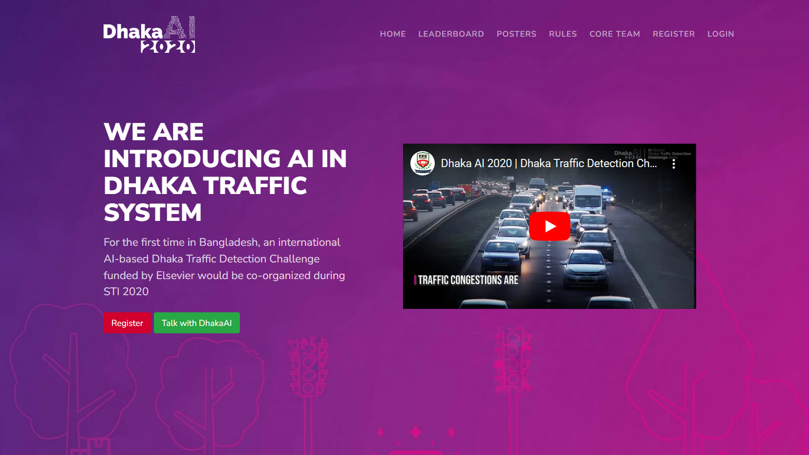
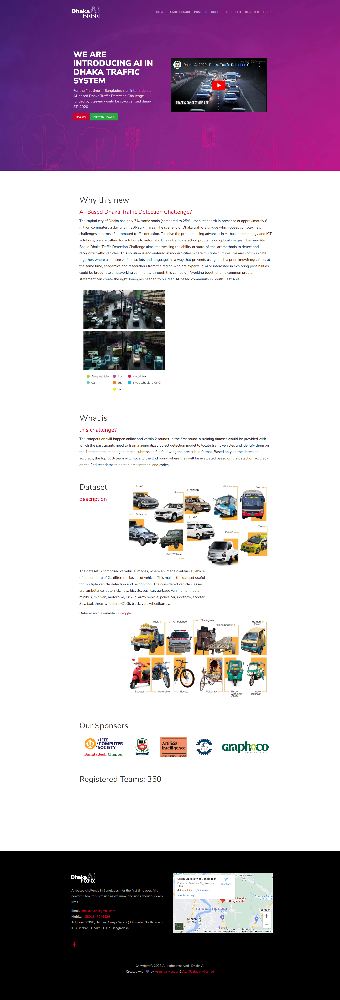
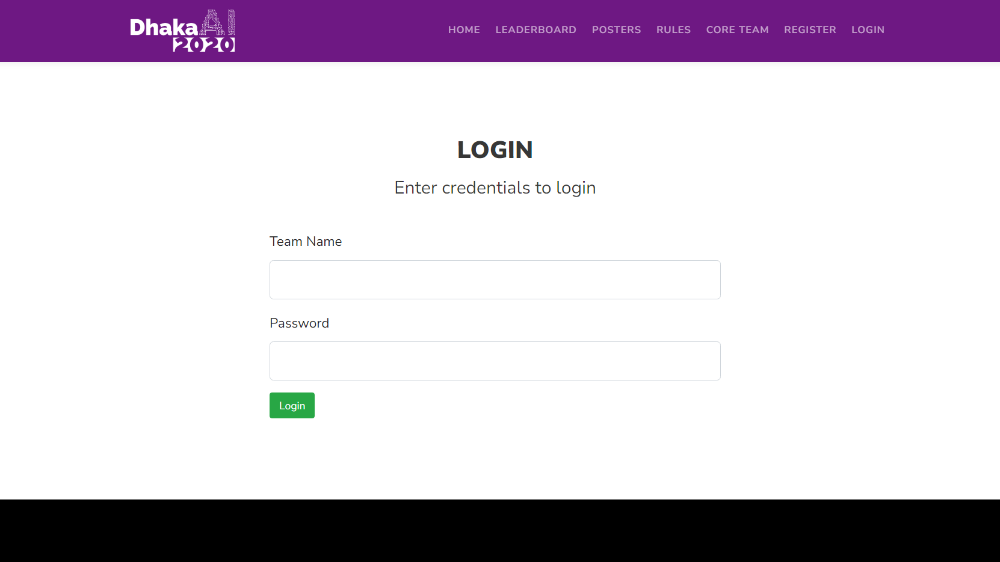

# Dhaka AI 2020 Traffic Detection Competition Website


# Getting Started
- Create a Python virtualenv environment and activate it.
    ```bash
    python3 -m virtualenv env
    ```

- Create a `.env` file and put the following contents in the file
    ```
    FLASK_APP=app.py
    FLASK_ENV=
    DB_HOST=
    DB_USERNAME=
    DB_PASSWORD=
    DB_NAME=
    MAIL_SENDER=
    MAIL_PASSWORD=
    MAIL_SERVER=
    MAIL_PORT=
    SECRET_KEY=
    ```

- After that, install the dependencies using
    ```
    python3 -m pip install -r requirements.txt
    ```

- Run the program using
    ```
    flask run
    ```
    or
    ```
    python3 app.py
    ```

# Screenshots
## Home Page Full


## Login Page Full


# Note
This code was written in 2020. Since then, Python has gone through a lot of ecosystem changes. Some of the packages might not be supported now.
